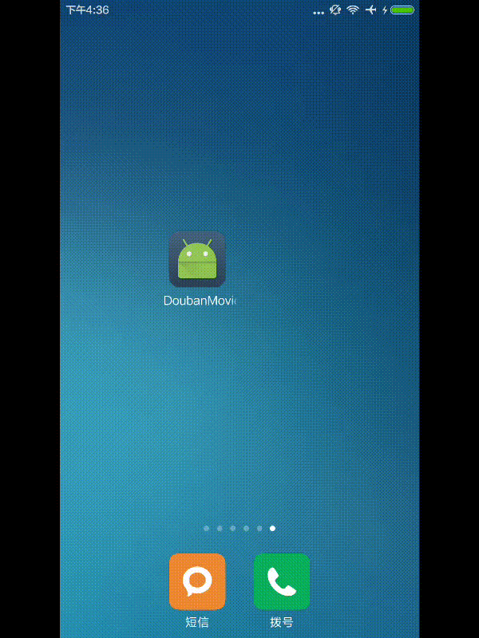
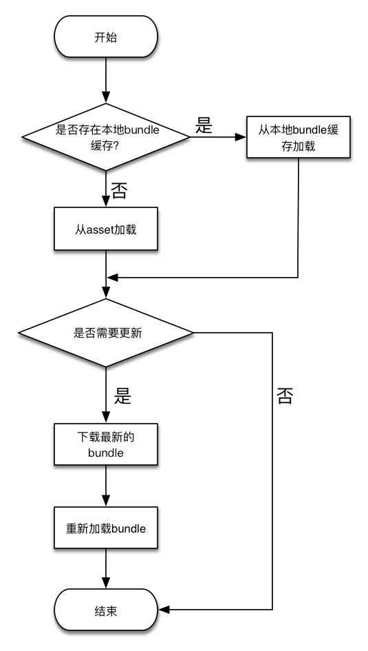

# 使用React-Native实现app热部署的一次实践


## 效果



## 原理
demo中执行热部署的实现流程如下：


最新版本的React Native版本中，加入了如下支持：

```java
	/**
     * Path to the JS bundle file to be loaded from the file system.
     *
     * Example: {@code "assets://index.android.js" or "/sdcard/main.jsbundle}
     */
    public Builder setJSBundleFile(String jsBundleFile) {
      mJSBundleFile = jsBundleFile;
      return this;
    }
```

这是热部署的突破口，由于React Native加载的js文件都打包在bundle中，通过这个方法，可以设置app加载的bundle来源。若检测到远端存在更新的bundle文件，下载好后重新加载即可。

为了在运行中重新加载bundle文件，查看`ReactInstanceManager`的源码，找到如下方法：

```java
  private void recreateReactContextInBackground(JavaScriptExecutor jsExecutor, JSBundleLoader jsBundleLoader) {
    UiThreadUtil.assertOnUiThread();

    ReactContextInitParams initParams = new ReactContextInitParams(jsExecutor, jsBundleLoader);
    if (!mIsContextInitAsyncTaskRunning) {
      // No background task to create react context is currently running, create and execute one.
      ReactContextInitAsyncTask initTask = new ReactContextInitAsyncTask();
      initTask.execute(initParams);
      mIsContextInitAsyncTaskRunning = true;
    } else {
      // Background task is currently running, queue up most recent init params to recreate context
      // once task completes.
      mPendingReactContextInitParams = initParams;
    }
  }
```

虽然这个方法是`private`的，不过不要紧，使用反射调用就行啦：

```java
private void onJSBundleLoadedFromServer() {

    try {
            Class<?> RIManagerClazz = mReactInstanceManager.getClass();
            Method method = RIManagerClazz.getDeclaredMethod("recreateReactContextInBackground",
                    JavaScriptExecutor.class, JSBundleLoader.class);
            method.setAccessible(true);
            method.invoke(mReactInstanceManager,
                    new JSCJavaScriptExecutor(),
                    JSBundleLoader.createFileLoader(getApplicationContext(), JS_BUNDLE_LOCAL_PATH));
        } catch (NoSuchMethodException e) {
            e.printStackTrace();
        } catch (IllegalAccessException e) {
            e.printStackTrace();
        } catch (InvocationTargetException e) {
            e.printStackTrace();
        } catch (IllegalArgumentException e) {
            e.printStackTrace();
        }
    }
```


## 总结

使用React Native进行热部署是可行的，只要远程提供打包好的bundle，app下载后重新加载即可；  

但是，这样的方案也具有一定的局限性：  

React Native在使用View的时候，这些View是要经过本地定制的，并且将相关方法通过`RCT_EXPORT_METHOD`暴露给js，js端才能正常使用。

比如，我们在新版本中使用了一个`PullToRefreshListView`，这个View必须在Native中被定制过，此时，单纯的更新bundle就会报错了，需要重新发包才能解决。
